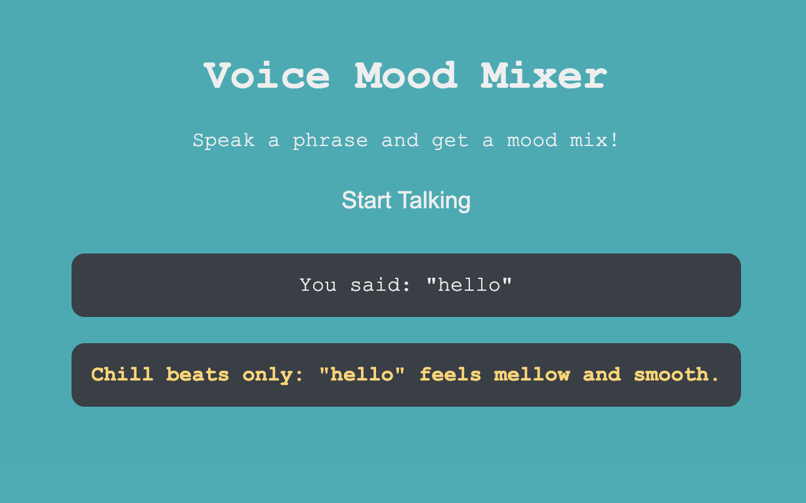

# Voice Mood Mixer

A fun web application that analyzes your speech and generates a mood-based response with dynamic visual feedback.

## Features

- **Speech Recognition**: Utilizes the Web Speech API to convert your spoken words into text
- **Sentiment Analysis**: Performs basic sentiment analysis on your speech to determine mood
- **Dynamic Responses**: Generates unique, mood-specific responses based on your speech content
- **Visual Feedback**: Changes the background color to match the detected mood:
  - Positive: Bright yellow
  - Negative: Dark gray
  - Neutral: Teal

## How It Works

1. Click the "Start Talking" button
2. Speak a phrase into your microphone
3. The app will transcribe your speech
4. Based on sentiment analysis, it will generate a mood mix response
5. The background color will change to match your mood

## Technical Details

- Built with vanilla JavaScript, HTML, and CSS
- Uses the Web Speech API for speech recognition
- Implements a simple rule-based sentiment analysis algorithm
- No external dependencies required

## Browser Compatibility

This application requires a browser that supports the Web Speech API. Compatible browsers include:

- Chrome (desktop and Android)
- Edge
- Safari (iOS and macOS)
- Firefox (with flag enabled)

## Getting Started

Simply open the `index.html` file in a compatible browser to start using the Voice Mood Mixer. No installation or setup required!
